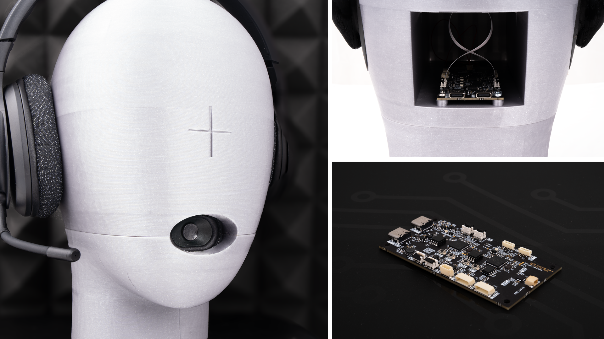

# Audio latency tester

Copyright (c) 2024-2025 [Antmicro](https://www.antmicro.com)

The aim of this project is to provide a platform for measurement and characterization of audio latencies. 

The repository includes:
* `.github/` - Directory with CI configuration
* `docs/` - Sphinx-based documentation for the project
* `audio_in_pdm/` - Directory with RP2040 firmware for audio input
* `audio_out/` - Directory with RP2040 firmware for audio output
* `include/` - Directory with RP2040 USB payload definitions
* `audio_capture.py` - Python application for a PC host responsible for collecting audio samples
* `audio_controller.py` - Python module for data transactions
* `audio_playback.py` - Python application for a PC host responsible for playing audio samples 
* `1s_44100_2ch_16b.wav` - Example recording of a 439 Hz tone