# Audio latency tester

Copyright (c) 2024-2025 [Antmicro](https://www.antmicro.com)

## Project overview

The aim of this project is to provide a platform for measurement and characterization of audio latencies. 


The tester suite includes:
* [Audio latency tester board](https://github.com/antmicro/audio-latency-tester-board) responsible for emitting sound with a speaker and collecting audio samples (in various sampling rates) from  a pair of microphones
* [Microphone board](https://github.com/antmicro/pdm-microphone-board) housing PDM microphone with selectable left or right channel audio output
* [Software controller](https://github.com/antmicro/audio-latency-tester) providing firmware for the RP2040 MCUs located on board Audio latency tester board as well as host PC application responsible for collecting and sending audio samples

### Tester suite architecture
The tester system integrates two microphones, an audio codec, an audio power amplifier and a speaker. These peripherals are driven with two separate RP2040 MCU units that can synchronize via a shared GPIO signal. 

System architecture is presented below:

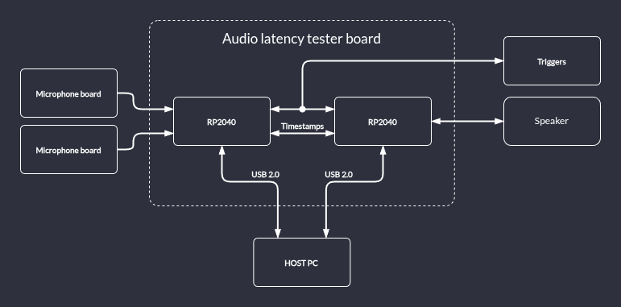

## Installation and setup

### Installing dependencies
`CMake` (3.20 or newer), `Python3` and the `ARM toolchain` are required to build the project.

To install the dependencies on Debian Bookworm, run:

```sh
apt install cmake python3 build-essential gcc-arm-none-eabi libnewlib-arm-none-eabi libstdc++-arm-none-eabi-newlib libusb-1.0-0-dev
```

To run the project it is also required to install `PyUSB`

```sh
pip install pyusb
```

### Build Audio latency tester

Clone the audio-latency-tester repository:

```sh
git clone https://github.com/antmicro/audio-latency-tester.git
cd audio-latency-tester
```

Install `pico-sdk` and `pico-extras` :

```sh
git clone --recurse-submodules --branch 2.1.0 https://github.com/raspberrypi/pico-sdk.git
git clone --recurse-submodules --branch sdk-2.1.0 https://github.com/raspberrypi/pico-extras.git
```

The build system uses environment variables to find these repositories:

```console
export PICO_SDK_PATH=$(pwd)/pico-sdk
export PICO_EXTRAS_PATH=$(pwd)/pico-extras
```


To build the project, run:

```console
cmake -S . -B build
cmake --build build -j$(nproc)
```

You can find the ELF and UF2 files in:

* `build/audio_out/rp2040-i2s-timestamp.elf`
* `build/audio_out/rp2040-i2s-timestamp.uf2`
* `build/audio_in_pdm/rp2040-i2s-timestamp-audio-in.elf`
* `build/audio_in_pdm/rp2040-i2s-timestamp-audio-in.uf2`

## Flashing hardware

### Install Picotool

In order to flash devices, `picotool` is needed.
The installation instructions can be found in this [readme](https://github.com/raspberrypi/picotool/blob/master/README.md).

### Running on hardware

The [Audio latency tester board](https://github.com/antmicro/audio-latency-tester-board) consist of 2 independent RP2040 - one for audio input, other for audio output.
Each of them has to be flashed with `.uf2` file prepared in the previous chapter.

#### Flashing Audio input firmware

* Connect MCU-1 USB-C (the port labeled as `USB-C Mics`) to your PC. LEDs should light up.

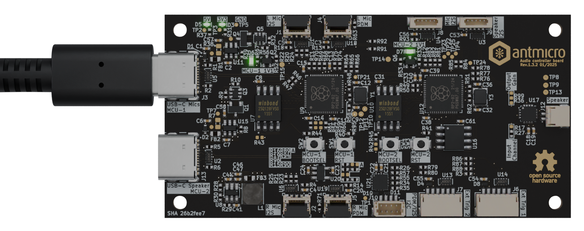

* Press and hold the `MCU-1 BOOTSEL` button
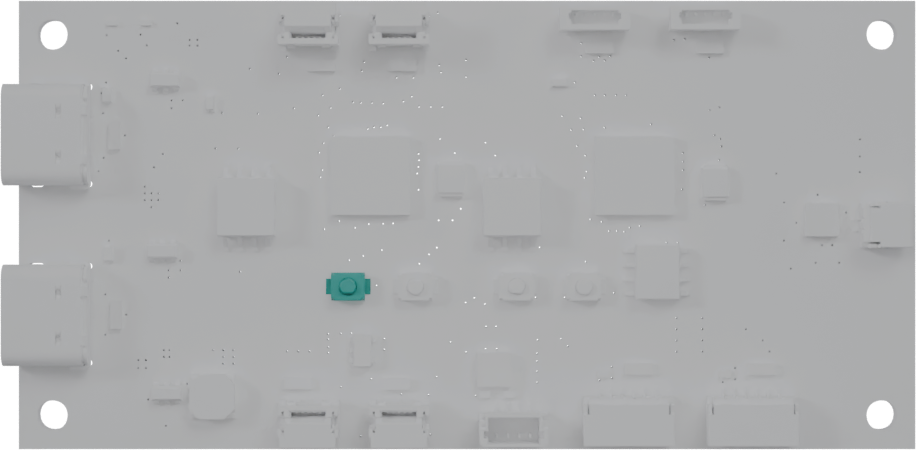
* Press and release the `MCU-1 RST` button
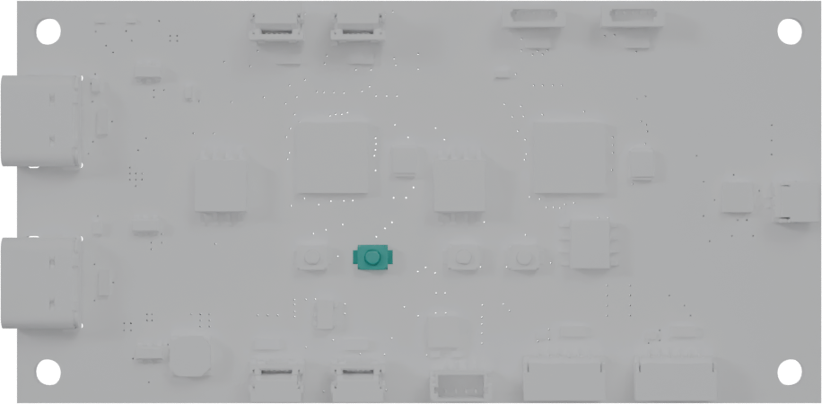
* Release the `MCU-1 BOOTSEL`

* Use `picotool` to flash the device and execute the program immediately:

```console
picotool load -x build/audio_in_pdm/rp2040-i2s-timestamp-audio-in.uf2
```
* With lsusb, you should see that the device is recognized as a USB device with ID `cafe:4010` 

```console
Bus 003 Device 012: ID cafe:4010 Raspberry Pi RP2040
```

#### Flashing Audio output firmware

* If still connected - remove the USB-C from previous step
* Connect MCU-2 USB-C (the port labeled as `USB-C Speaker`) to your PC. LEDs should light up.

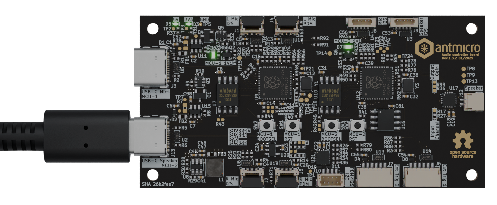

* Press and hold the `MCU-2 BOOTSEL` button
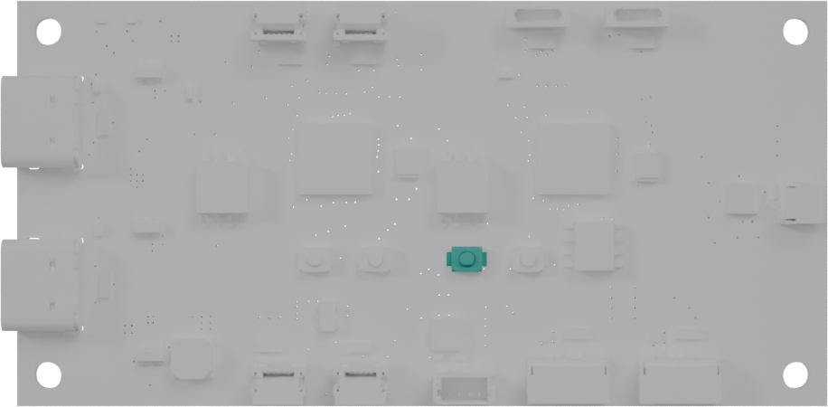
* Press and release the `MCU-2 RST` button
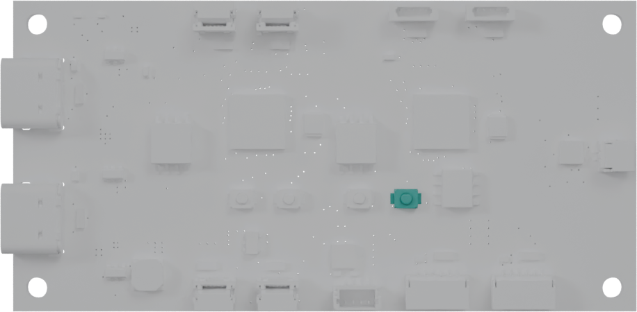
* Release the `MCU-2 BOOTSEL`

* Use `picotool` to flash the device and execute the program immediately:

```console
picotool load -x build/audio_out/rp2040-i2s-timestamp.uf2
```
* With lsusb, you should see that the device is recognized as a USB device with ID `cafe:4011` 

```console
Bus 003 Device 012: ID cafe:4011 Raspberry Pi RP2040
```

## Usage

In order to use these scripts, you need a microcontroller flashed with images from previous step connected via USB for communication.

The scripts require libusb, Python3, PyUSB, and sufficient access rights to the connected USB devices.

### Hardware preparation

Before proceeding further, it is nessesary to connect the [microphone board](https://github.com/antmicro/pdm-microphone-board) to the [audio latency tester board](https://github.com/antmicro/audio-latency-tester-board).
The microphone board is a small footprint carrier board for a PDM microphone. Two of these boards can be joined for a stereo configuration (after configuring two microphone boards for a left and right channel)
* To select the microphone board's channel populate the resistor in one of two orientations.


* Connect [microphone boards](https://github.com/antmicro/pdm-microphone-board) to [audio latency tester board](https://github.com/antmicro/audio-latency-tester-board) with a 5 pin, 0.5 mm pitch, same-side flat flexible cable. 


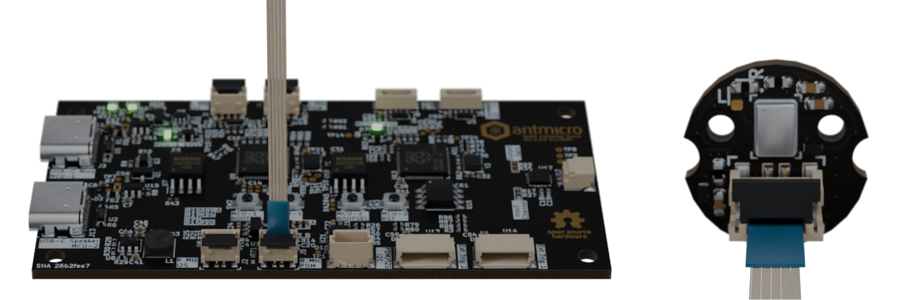


The audio latency tester board has two connector for the microphone boards marked as L or R MIC PDM

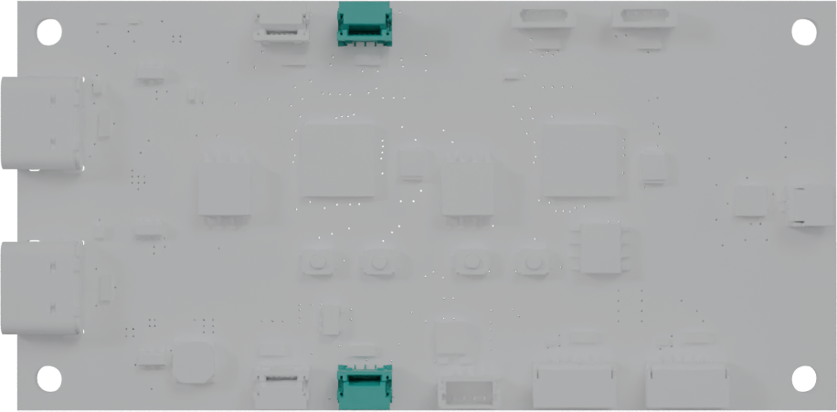

* Connect an external speaker to the speaker connector

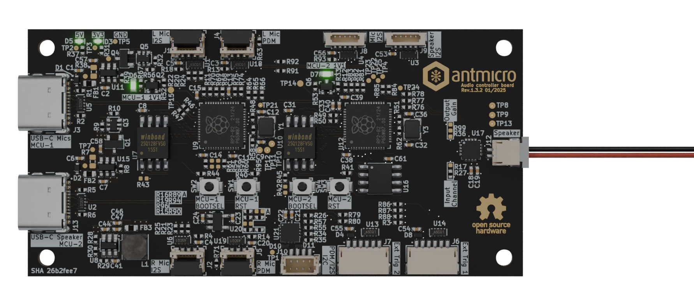

* Triger input and outputs can be connected to the J6 and J7 connector. For a detailed pinout please consult the [audio latency tester board](https://github.com/antmicro/audio-latency-tester-board)
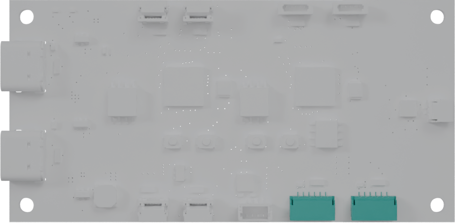

* Connect MCU-1 and MCU-2 USB-C to your PC
### Audio playback

In order to play an audio file, provide a `.wav` file as argument to the `audio_playback.py` script:

```console
python3 audio_playback.py <file>
```

You can find the timestamps in `timestamps.log`.

### Audio capture

In order to capture audio and save it to a `.wav` file, use the `audio_capture.py` script:

```console
python3 audio_capture.py <file>`
```

You can find the timestamps in `timestamps.log`.

### Windows 11 support

In order to run the scripts on Windows 11, additional configuration of the USB devices is required beforehand.

A driver facilitating communication with userspace needs to be configured for the devices. The recommended way to do that by libusb documentation is to use the [Zadig tool](http://zadig.akeo.ie/).

1. Download and run the Zadig tool
2. In the configuration window, select "RP2040" device from the drop-down list
3. Make sure the WinUSB driver is selected and press the "Install Driver" button

After the driver installation is completed, AudioController should be able to communicate with the device.
The configuration needs to be performed separately for audio input and output devices.