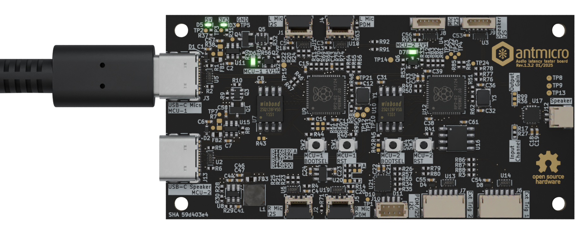

# Installation and setup

## Installing dependencies
`CMake` (3.20 or newer), `Python3` and the `ARM toolchain` are required to build the project.

To install the dependencies on Debian Bookworm, run:

```sh
apt install cmake python3 build-essential gcc-arm-none-eabi libnewlib-arm-none-eabi libstdc++-arm-none-eabi-newlib libusb-1.0-0-dev
```

To run the project it is also required to install `PyUSB`:

```sh
pip install pyusb
```

## Build RP2040 firmware
Clone the audio-latency-tester repository:

```sh
git clone https://github.com/antmicro/audio-latency-tester.git
cd audio-latency-tester
```

Install `pico-sdk` and `pico-extras` :

```sh
git clone --recurse-submodules --branch 2.1.0 https://github.com/raspberrypi/pico-sdk.git
git clone --recurse-submodules --branch sdk-2.1.0 https://github.com/raspberrypi/pico-extras.git
```

The build system uses environment variables to find these repositories:

```console
export PICO_SDK_PATH=$(pwd)/pico-sdk
export PICO_EXTRAS_PATH=$(pwd)/pico-extras
```


To build the project, run:

```console
cmake -S . -B build
cmake --build build -j$(nproc)
```

You can find the ELF and UF2 files in:

* `build/audio_out/rp2040-i2s-timestamp.elf`
* `build/audio_out/rp2040-i2s-timestamp.uf2`
* `build/audio_in_pdm/rp2040-i2s-timestamp-audio-in.elf`
* `build/audio_in_pdm/rp2040-i2s-timestamp-audio-in.uf2`

## Flashing hardware

### Install Picotool

In order to flash devices, `picotool` is needed.
The installation instructions can be found in this [readme](https://github.com/raspberrypi/picotool/blob/master/README.md).

### Running on hardware

The [Audio latency tester board](https://github.com/antmicro/audio-latency-tester-board) consist of 2 independent RP2040 - one for audio input, other for audio output.
Each of them has to be flashed with `.uf2` file prepared in the previous chapter.

#### Flashing Audio input firmware

* Connect MCU-1 USB-C (the port labeled as `USB-C Mics`) to your PC. LEDs should light up.

:::{figure-md}


MCU-1 USB-C connection
:::


* Press and hold the `MCU-1 BOOTSEL` ([`SW2`](#SW2)) button.

* Press and release the `MCU-1 RST` ([`SW1`](#SW1)) button.

* Release the `MCU-1 BOOTSEL`.

* Use `picotool` to flash the device and execute the program immediately:

```console
picotool load -x build/audio_in_pdm/rp2040-i2s-timestamp-audio-in.uf2
```
* With lsusb, you should see that the device is recognized as a USB device with ID `cafe:4010` 

```console
Bus 003 Device 012: ID cafe:4010 Raspberry Pi RP2040
```

#### Flashing Audio output firmware

* If still connected - remove the USB-C from previous step.
* Connect MCU-2 USB-C (the port labeled as `USB-C Speaker`) to your PC. LEDs should light up.

:::{figure-md}


MCU-2 USB-C connection
:::


* Press and hold the `MCU-2 BOOTSEL` ([`SW4`](#SW4)) button. 

* Press and release the `MCU-2 RST` ([`SW3`](#SW3)) button.

* Release the `MCU-2 BOOTSEL`.

* Use `picotool` to flash the device and execute the program immediately:

```console
picotool load -x build/audio_out/rp2040-i2s-timestamp.uf2
```
* With lsusb, you should see that the device is recognized as a USB device with ID `cafe:4011` 

```console
Bus 003 Device 012: ID cafe:4011 Raspberry Pi RP2040
```