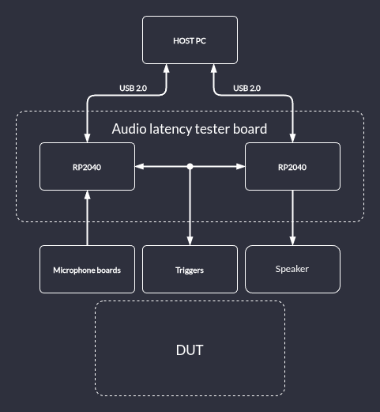

# Project overview

Audio latency is a key factor in determining the quality of the user experience in communication services.
A controlled delay is necessary for responsive and natural communication as it helps mitigate problems such as echo, timing issues, or a fragmented user experience.

The aim of this project is to provide a platform for measurement and characterization of audio latencies.

The tester suite includes:
* [Audio latency tester board](https://github.com/antmicro/audio-latency-tester-board) - responsible for synchronized emitting sound with a speaker and collecting audio samples (in various sampling rates) from  a pair of microphones
* [Microphone board](https://github.com/antmicro/pdm-microphone-board) - houses a PDM microphone with selectable left or right channel audio output
* [Software controller](https://github.com/antmicro/audio-latency-tester) - provides firmware for the RP2040 MCUs located on the Audio latency tester board, as well as host PC application responsible for collecting, sending and automatically analyzing audio samples
* Speaker

## Tester suite architecture
The tester system integrates two microphones, an audio codec, an audio power amplifier and a speaker. These peripherals are driven with two separate RP2040 MCU units, one for playback and one for recording, that can synchronize timebase via a shared GPIO signal.

System architecture is presented below:

:::{figure-md}

System architecture
:::
