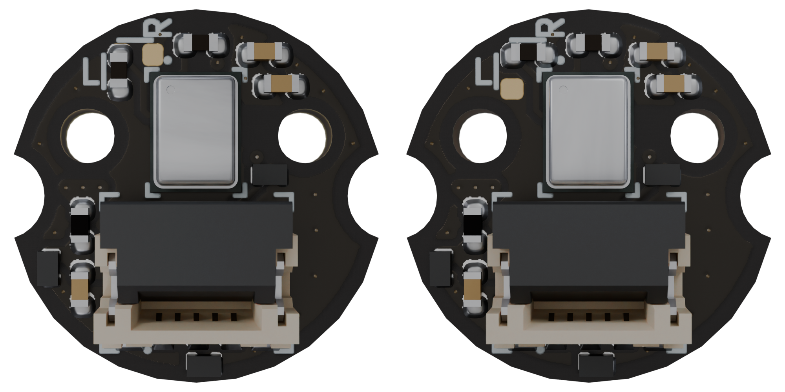
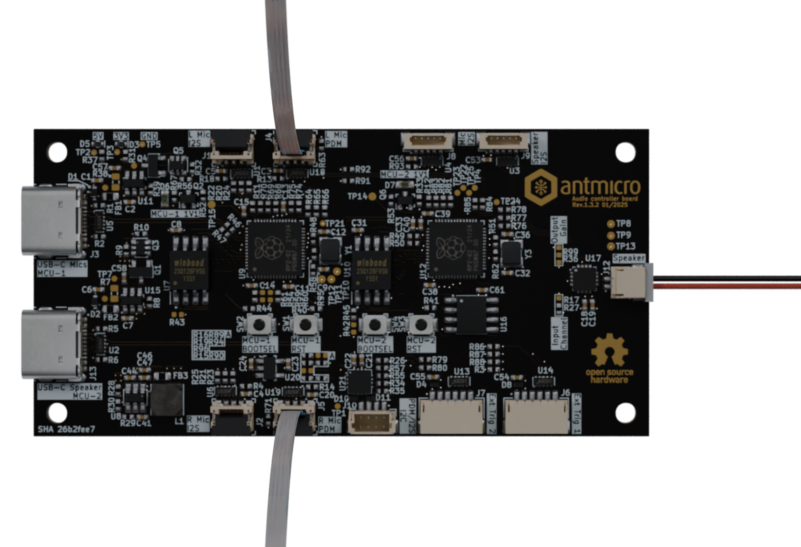
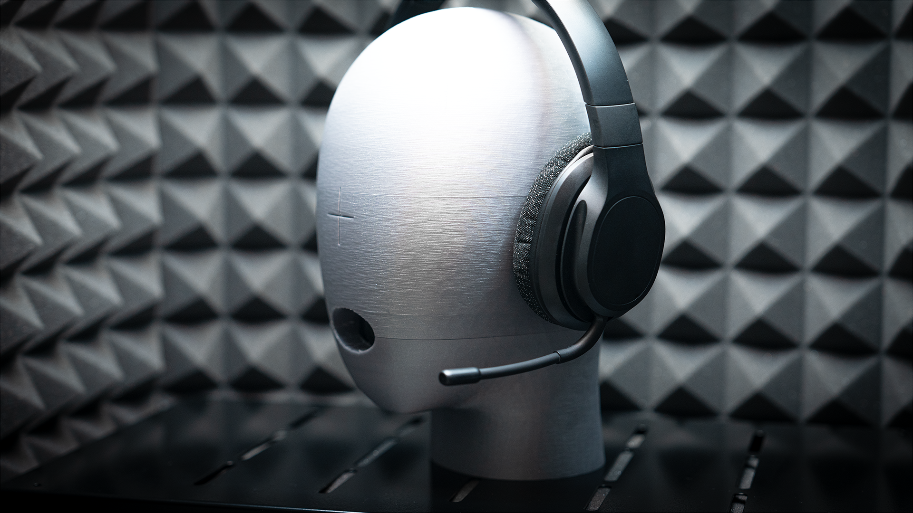
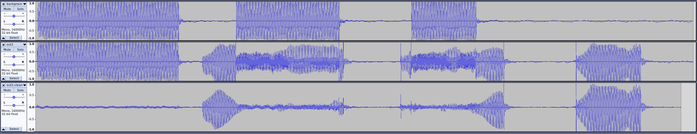
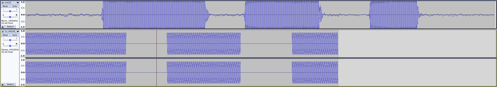

# Usage

In order to use the scripts described in this chapter, you need the [Audio latency tester board](https://github.com/antmicro/audio-latency-tester-board) flashed with firmware from the [`flashing hardware`](./installation.md#flashing-hardware) section.

The [scripts]((https://github.com/antmicro/audio-latency-tester)) require Python packages from [installing dependencies](./installation.md#installing-dependencies) chapter and sufficient access rights to the connected USB devices.

## Hardware preparation

Before proceeding further, it is necessary to connect the [microphone board](https://github.com/antmicro/pdm-microphone-board) to the [audio latency tester board](https://github.com/antmicro/audio-latency-tester-board).
The microphone board is a small footprint carrier board for a PDM microphone. Two of these boards can be joined for a stereo setup (after configuring two microphone boards for a left and right channel respectively).
* To select the microphone board's channel, populate the resistor in one of the two orientations:

:::{figure-md}


Microphone board left/right channel selection
:::

* Connect [microphone boards](https://github.com/antmicro/pdm-microphone-board) to the [audio latency tester board](https://github.com/antmicro/audio-latency-tester-board) with a 5 pin, 0.5 mm pitch, same-side flat flexible cable:


:::{Caution}
Make sure to disconnect all the power sources from the `audio latency tester board` before plugging or unplugging the microphone boards
:::

:::{figure-md}


FFC connections
:::

The audio latency tester board has two connectors for the microphone boards:  [`J4`](#J4) and [`J5`](#J5).

:::{Tip}
To insert the FFC, push the connector's lever down, insert the FFC and pull the lever up
:::

* Connect an external speaker to the speaker connector:

:::{figure-md}


Speaker connectors
:::

* Trigger input and outputs can be connected to the  [`J6`](#J6) and [`J7`](#J7) connector. For more detailed pinout information, refer to the [audio latency tester board](https://github.com/antmicro/audio-latency-tester-board) repository.

* Connect MCU-1 and MCU-2 USB-C to your PC.

* With `lsusb`, you should see that both the devices are recognized:

```console
Bus 001 Device 021: ID cafe:4011 Raspberry Pi RP2040
Bus 001 Device 022: ID cafe:4010 Raspberry Pi RP2040
```

## Standalone playback/capture scripts

Before performing the measurements, it is possible to test the audio playback and audio capture.

Activate the virtual environment:
```sh
source .venv/bin/activate
```

### Audio playback

In order to play an audio file, provide a `.wav` file as argument to the `audio_playback.py` script:

```sh
python3 audio_playback.py <file>
```

The scripts outputs timestamps of the played audio sections (per every 32 audio samples) - `timestamps-playback.log`

:::{Tip}
Play the example audio file with:
```sh
python3 audio_playback.py 1s_44100_2ch_16b.wav
```
:::

### Audio capture

In order to capture audio and save it to a `.wav` file, use the `audio_capture.py` script:

```sh
python3 audio_capture.py <file>
```

Output files from this script include:

* Recorded audio `.wav` file
* Timestamps of 16 audio samples long recorded sections - `timestamps-capture.log`


## Synchronized audio capture and playback

To get accurate audio latency measurements, both the MCUs need to be in sync. When using the `play_capture.py` script, the playback MCU will trigger the capture MCU right before the audio playback is started.

Make sure the virtual environment is activated
```sh
source .venv/bin/activate
```


```sh
python3 play_capture.py <file>
```

Output files from this script include:

* Recorded audio `out.wav` file
* Timestamps of recorded audio sections (per every 16 audio samples)
* Timestamps of played audio sections (per every 32 audio long)

:::{Tip}
Environmental conditions may vary. If there is a problem with the speaker or microphone volume, use `--volume-play <default:4000>` and `--volume-capture <default:100>`.

Play the example audio file with:
```sh
python3 play_capture.py --duration=1 1s_44100_2ch_16b.wav
```
:::

## Data interpretation

After performing [synchronized audio capture and playback](#synchronized-audio-capture-and-playback), the recorded audio can be compared with the reference (played) audio file. The `analyze.py` script located in the `automated_test` folder can match the sound starting/stopping to associate the moments in time between wav files.

```sh
python3 ./automated_test/analyze.py <reference_file> <recorded_file>
```

The script outputs a `results.csv` file with each matched starting/stopping moment from the `.wav` files listed with a timestamp.

:::{Tip}
To compare recorded audio with the example audio file use:
```sh
python3 ./automated_test/analyze.py 1s_44100_2ch_16b.wav out.wav
```
:::

Audio latency of the measurement system prototype itself was measuread as `3.31 ms`.
The reference recordings and calculations can be found in the `doc/base-system-latency-measurements` folder.

## Example measurements

This section contains example audio latency measurements, for better visualization of the process.
We conducted masurement of two systems:

* `Bluetooth 5.2` headset with a PC
* `Google Meet` connection via WiFi

### `Bluetooth 5.2` headset latency measurement

The device under test consisted of:

* PC with `Debian 12` system equipped with `Bluetooth` card
* A wireless headset (speakers + microphone) compatible with `Bluetooth 5.2` 

:::{figure-md}


Wireless headset testing setup
:::

The PC was configured to loopback the audio from the `headset's microphone` back to `headset's speakers`.
For this specific configuration following command was used:

```sh
pw-link bluez_input.3F_21_BD_E1_4F_44.0 bluez_output.3F_21_BD_E1_4F_44.1
```
The test procedure consisted of following steps:
* Audio bleed recording - without the device under test ie.: the headset was muted.

```sh
python3 play_capture.py --duration=1.5 --volume-play 30000 1s_44100_2ch_16b.wav --out-wav background.wav
```

This recording was later used to remove overlap between the playback gathered directly by the latency tester microphone and the playback passed through the device under test.


* Audio latency measurement recordings - with the device under test active ie.: the headset was un-muted and it's microphone was on:

```sh
python3 play_capture.py --duration=1.5 --volume-play 30000 1s_44100_2ch_16b.wav --out-wav out1.wav
```
In total, 10 recordings were made


* Background removal - The recorded `background.wav` was removed from the audio latency measurement recordings, using `Short-Time Fourier Transform`.

```sh
python3 remove_background.py out1.wav background.wav out1-clean.wav
```

*  Automated calculation analyze- Following scripts detects the audio start and stop moments. Then, it compares them with the original audio file and calculates the delays.

```sh
python3 ./automated_test/analyze.py 1s_44100_2ch_16b.wav out1-clean.wav out2-clean.wav out3-clean.wav out4-clean.wav out5-clean.wav out6-clean.wav out7-clean.wav out8-clean.wav out9-clean.wav out10-clean.wav
```

The resulting `results.csv` spreadsheet was then used to calculate the average latency: `375ms`.

:::{Note}
Keep in mind that this latency includes: Bluetooth data transmission (both ways) and data processing (in the headset and the PC's operating system)
:::

Recordings from that test can be found in the `doc/bt-headset-latency-measurements` folder.

:::{figure-md}


Recorded and processed audio waveforms
:::

### `Google Meet` connection latency measurement

The device under test consisted of:

* PC with Debian 12 system and `Google Meet` running in a `Google Chrome` web browser
* An Android smartphone with `Google Meet` application

Both devices were connected to a `Google Meet` meeting via the same Wi-Fi network. A speaker connected to the [audio latency tester board](https://github.com/antmicro/audio-latency-tester-board) was placed in front of the smartphone, while a microphone board was attached to headphones connected to the PC.

10 recordings were made using:

```sh
python3 play_capture.py --duration=1.5 --volume-play 400 --volume-capture 200 1s_44100_2ch_16b.wav --out-wav out1.wav
```

and were later interpreted with:

```sh
python3 ./automated_test/analyze.py 1s_44100_2ch_16b.wav out1.wav out2.wav out3.wav out4.wav out5.wav out6.wav out7.wav out8.wav out9.wav out10.wav
```

The resulting `results.csv` spreadsheet was then used to calculate the average latency: `257 ms`.

Recordings from that test can be found in the `doc/meet-latency-measurements` folder.

:::{figure-md}


Recorded and reference audio waveforms
:::