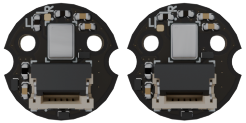

# Usage

In order to use these scripts, you need a microcontroller flashed with firmware from [`flashing hardware`](./installation.md#flashing-hardware) section.

The scripts require libusb, Python3, PyUSB, and sufficient access rights to the connected USB devices.

## Hardware preparation

Before proceeding further, it is nessesary to connect the [microphone board](https://github.com/antmicro/pdm-microphone-board) to the [audio latency tester board](https://github.com/antmicro/audio-latency-tester-board).
The microphone board is a small footprint carrier board for a PDM microphone. Two of these boards can be joined for a stereo setup (after configuring two microphone boards for a left and right channel respectively).
* To select the microphone board's channel populate the resistor in one of two orientations:

:::{figure-md}


Microphone board channel selection
:::

* Connect [microphone boards](https://github.com/antmicro/pdm-microphone-board) to [audio latency tester board](https://github.com/antmicro/audio-latency-tester-board) with a 5 pin, 0.5 mm pitch, same-side flat flexible cable:


:::{Caution}
Make sure to disconnect all the power sources from the `audio latency tester board` before plugging or unplugging the microphone boards
:::

:::{figure-md}


FFC connections
:::

The audio latency tester board has two connector for the microphone boards:  [`J4`](#J4) and [`J5`](#J5).

:::{Tip}
To insert the FFC, push the connector's leaver down, insert the FFC and pull the leaver up
:::

* Connect an external speaker to the speaker connector:

:::{figure-md}


Speaker connectors
:::

* Triger input and outputs can be connected to the  [`J6`](#J6) and [`J7`](#J7) connector. For a detailed pinout please consult the [audio latency tester board](https://github.com/antmicro/audio-latency-tester-board).

* Connect MCU-1 and MCU-2 USB-C to your PC.

* With `lsusb`, you should see that both the devices are recognized

```console
Bus 001 Device 021: ID cafe:4011 Raspberry Pi RP2040
Bus 001 Device 022: ID cafe:4010 Raspberry Pi RP2040
```

## Scripts usage

Activate the virtual environment
```console
source .venv/bin/activate
```

## Audio playback

In order to play an audio file, provide a `.wav` file as argument to the `audio_playback.py` script:

```console
python3 audio_playback.py <file>
```

You can find the timestamps in `timestamps-playback.log`.

:::{Tip}
Play the example audio file with:
```console
python3 audio_playback.py 1s_44100_2ch_16b.wav 
```
:::

## Audio capture

In order to capture audio and save it to a `.wav` file, use the `audio_capture.py` script:

```console
python3 audio_capture.py <file>`
```

You can find the timestamps in `timestamps-capture.log`.